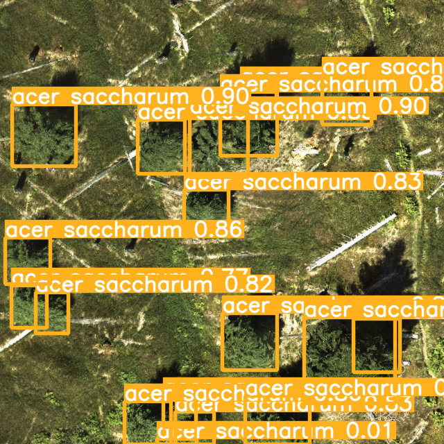

## Installation

Conda environment    

``` shell
# git clone this repository
git clone https://github.com/dongjuns/yolov9.git

# go to code folder
cd /yolov9

# pip install required packages
pip install -r requirements.txt
```

## Dataset

Download the tree label dataset: https://zenodo.org/records/15351054        

Make a 'tree_data' directory and move all the tree data directories into it.    

```shell
tree_data/        
        0_RGB_FullyLabeled     
        5_RGB_S_320_pL    
        12_RGB_ObjDet_640_fL    
        34_RGB_ObjDet_640_pL    
        34_RGB_ObjDet_640_pL_b    
        test    
```


### Data preprocess: class id    
(1) The class IDs of the 0_RGB_FullyLabeled dataset were mismatched with other datasets, so they were aligned accordingly.    
(2) For YOLO model training, all class IDs were decremented by 1. (starts from 0~)     


### Data preprocess: image tile    
0_RGB_FullyLabeled includes high resoultion images, so I made it four tiles when the image shape is over 800x800.    
0_RGB_FullyLabeled_tile directory would be created in tree_data.    
*reference: preprocess.ipynb

<div align="center">
    <a href="./">
        
    </a>
</div>


### Pre trained weight    
- Download the pretrained weights (last.pt, gelan-e.pt) and moved them into weights directory: https://drive.google.com/drive/folders/1ktPsE8r2vPNhkfIJJbABB_oEgTFcD9YJ?usp=sharing    


## Training

Single GPU training

``` shell
# train gelan models
python train.py --batch 32 --epochs 300 --img 640 --device 0 --data ./data/tree.yaml --weights ./weights/gelan-e.pt --cfg models/detect/tree.yaml --hyp hyp.scratch-high.yaml --workers 2 --patience 100
```

## Inference

<div align="center">
    <a href="./">
        
    </a>
</div>

``` shell
# inference gelan models
python detect.py --weights ./weights/last.pt --source ./tree_data/test --device 0 --save-txt --save-conf --conf-thres 0.01 --agnostic-nms
```


## Model
YOLOv9 GELAN is a lightweight, high-performance object detection architecture that efficiently aggregates multi-scale features while enhancing gradient flow through Programmable Gradient Information (PGI).    

<div align="center">
    <a href="./">
        
    </a>
</div>

<div align="center">
    <a href="./">
        
    </a>
</div>


<div align="center">
    <a href="./">
        
    </a>
</div>


## Citation

```
@article{wang2024yolov9,
  title={{YOLOv9}: Learning What You Want to Learn Using Programmable Gradient Information},
  author={Wang, Chien-Yao  and Liao, Hong-Yuan Mark},
  booktitle={arXiv preprint arXiv:2402.13616},
  year={2024}
}
```

```
@article{chang2023yolor,
  title={{YOLOR}-Based Multi-Task Learning},
  author={Chang, Hung-Shuo and Wang, Chien-Yao and Wang, Richard Robert and Chou, Gene and Liao, Hong-Yuan Mark},
  journal={arXiv preprint arXiv:2309.16921},
  year={2023}
}
```


## Acknowledgements

<details><summary> <b>Expand</b> </summary>

* [https://github.com/AlexeyAB/darknet](https://github.com/AlexeyAB/darknet)
* [https://github.com/WongKinYiu/yolor](https://github.com/WongKinYiu/yolor)
* [https://github.com/WongKinYiu/yolov7](https://github.com/WongKinYiu/yolov7)
* [https://github.com/VDIGPKU/DynamicDet](https://github.com/VDIGPKU/DynamicDet)
* [https://github.com/DingXiaoH/RepVGG](https://github.com/DingXiaoH/RepVGG)
* [https://github.com/ultralytics/yolov5](https://github.com/ultralytics/yolov5)
* [https://github.com/meituan/YOLOv6](https://github.com/meituan/YOLOv6)

</details>
